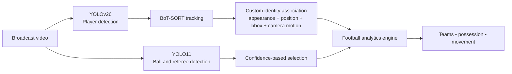

# Football YOLO


A computer vision project focused on extracting football analytics from broadcast video using object detection, multi-object tracking, and video understanding techniques.

## Demo

[Watch the demo video](football_yolo_videos_demo/demo_vid.avi)

The demo shows player detection, persistent tracking IDs, team classification, ball tracking, possession estimation, and camera-movement analysis on real broadcast footage.

## Features

- Detects players, referees, and the ball from broadcast footage
- Tracks player movement and maintains identities across frames
- Separates teams using jersey-color analysis
- Estimates ball possession and player-ball interaction
- Compensates for camera movement during tracking
- Produces annotated video and structured analytics

## Architecture

Two specialized YOLO models handle different detection problems: players require robust tracking, while the ball and referees require football-specific detection.



**Camera-motion compensation:** OpenCV optical-flow estimation detects broadcast camera movement so player positions can be interpreted more reliably during pans and transitions.

## Computer Vision Pipeline

### Player Understanding

YOLOv26 detects players while BoT-SORT maintains temporal tracking. A custom ReID-style identity-association layer improves stability by combining appearance features, position prediction, bounding-box consistency, and camera-motion compensation.

### Ball and Referee Detection

A separate YOLO11 model handles football-specific objects:

- Ball detection
- Referee detection
- Ball trajectory support

### Video Intelligence

OpenCV-based processing supports optical-flow camera-motion estimation, coordinate transformation, and player movement analysis.

## Tech Stack

**Core:** Python

**Computer vision:** YOLOv26, YOLO11, OpenCV, Supervision

**Tracking:** BoT-SORT, custom ReID-style identity association

**Data:** NumPy, pandas, scikit-learn

## Challenges Solved

- **Identity persistence:** Occlusions, similar jerseys, fast movement, and camera changes can break naive tracking. Appearance, position, and bounding-box signals are combined to improve consistency.
- **Camera motion:** Broadcast pans and transitions distort raw player motion. Optical-flow estimation helps isolate camera movement from scene movement.
- **Small-object detection:** The ball is small, fast, and frequently occluded, so it is handled by a dedicated football-object model.

## Current Limitations

Building reliable football intelligence from broadcast video remains a challenging computer vision problem. Current limitations include:

### Player Identity Persistence

- Player identities can occasionally switch during heavy occlusions, rapid movements, or crowded situations.
- The current ReID approach improves tracking consistency within a video sequence but does not yet perform full professional-level player recognition.

### Broadcast Camera Variations

- The system is optimized for single broadcast camera footage.
- Different camera angles, zoom changes, and cuts can affect tracking stability.
- Multi-camera synchronization and cross-view identity matching are future improvements.

### Ball Tracking Challenges

- The football is a small and fast-moving object, making detection difficult during:
    - Long passes
    - Occlusions
    - Motion blur
    - Crowded player interactions

### Event Understanding

- Current analytics focus on tracking and possession-based insights.
- Advanced football events such as passes, shots, goals, fouls, and tactical actions require additional temporal reasoning models.

### Real-Time Deployment

- The current pipeline prioritizes accuracy and analysis quality.
- Further optimization is required for real-time inference on edge devices or live match processing.

## Future Improvements

- Stronger player ReID models
- Multi-camera tracking across broadcast and tactical views
- Pass, shot, and goal detection
- Player-duel detection
- Tactical shape analysis and heatmaps
- Advanced football analytics

## Repository Structure

```text
main.py                       Main analysis pipeline
track_player/                 YOLO and BoT-SORT tracking
team_allocator/               Jersey-color team classification
player_ball_assigner/         Ball-to-player assignment
camera_movement/              Camera-motion utilities
utils/                        Video and bounding-box helpers
images/                       README portfolio banner
football_yolo_videos_demo/    Annotated demo video
```

## Credits

**Author:** [Ashpe Osk](https://github.com/ashpe-osk)
