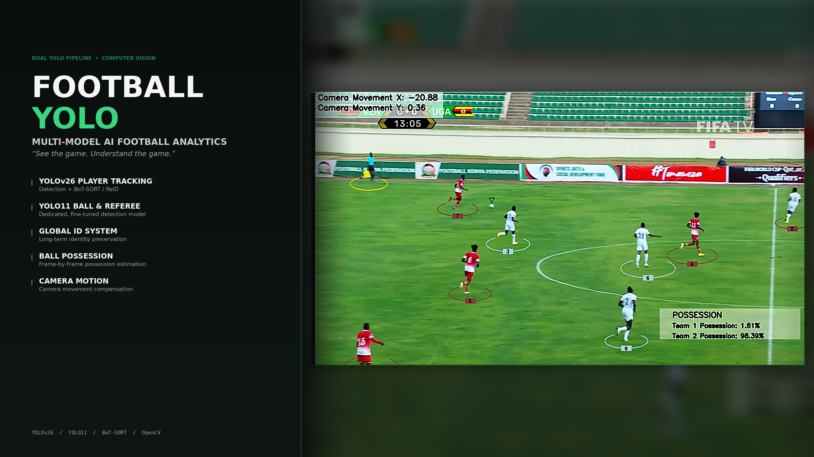
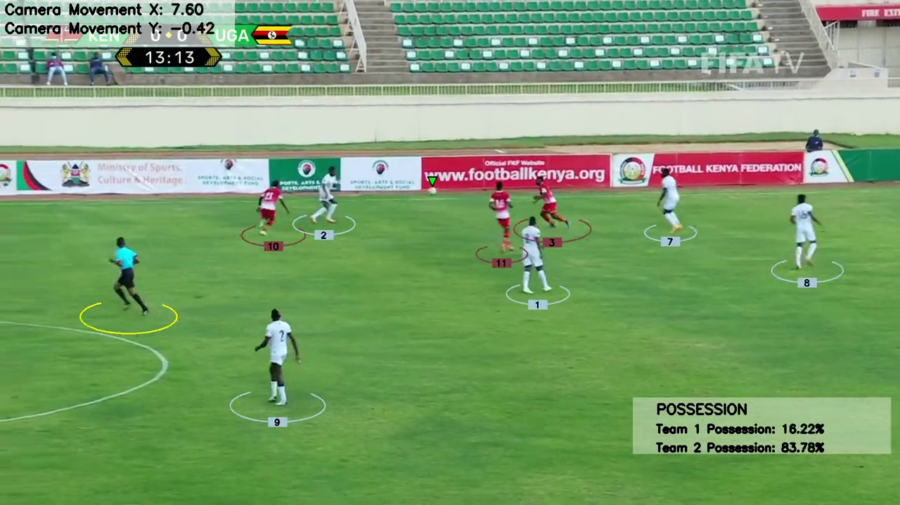
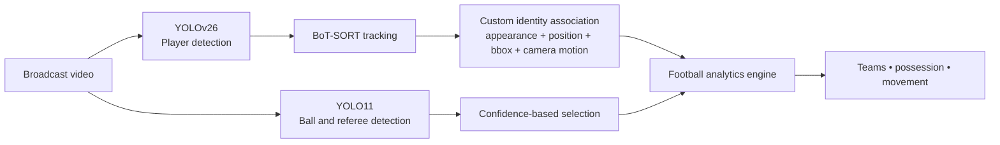

# Football YOLO



A computer vision project focused on extracting football analytics from broadcast video using object detection, multi-object tracking, and video understanding techniques.

## Demo

[](https://ashpe-osk.github.io/football-yolo/)

Click the thumbnail to watch on the project's GitHub Pages demo site. The demo shows player detection, persistent tracking IDs, team classification, ball tracking, possession estimation, and camera-movement analysis on real broadcast footage.

## Features

- Detects players, referees, and the ball from broadcast footage
- Tracks player movement and maintains identities across frames
- Separates teams using jersey-color analysis
- Estimates ball possession and player-ball interaction
- Compensates for camera movement during tracking
- Produces annotated video and structured analytics

## Architecture

Two specialized YOLO models handle different detection problems: players require robust tracking, while the ball and referees require football-specific detection.



**Player pipeline:** YOLOv26 detects players, BoT-SORT maintains temporal tracking, and a custom ReID-style identity layer stabilizes IDs using appearance, position, bounding-box consistency, and camera-motion compensation.

**Ball/referee pipeline:** a separately fine-tuned YOLO11 model detects the ball and referees, with confidence-based selection supporting ball trajectory continuity.

**Camera-motion compensation:** OpenCV optical-flow estimation detects broadcast camera movement so player positions can be interpreted reliably during pans and transitions.

## Tech Stack

**Core:** Python

**Computer vision:** YOLOv26, YOLO11, OpenCV, Supervision

**Tracking:** BoT-SORT, custom ReID-style identity association

**Data:** NumPy, pandas, scikit-learn

## Challenges Solved

- **Identity persistence:** occlusions, similar jerseys, fast movement, and camera changes can break naive tracking. Appearance, position, and bounding-box signals are combined to improve consistency.
- **Camera motion:** broadcast pans and transitions distort raw player motion. Optical-flow estimation helps isolate camera movement from scene movement.
- **Small-object detection:** the ball is small, fast, and frequently occluded, so it's handled by a dedicated football-object model.

## Current Limitations

- **Identity switches:** can occur during heavy occlusions, rapid movements, or crowded situations — the current ReID approach improves in-sequence consistency but isn't full professional-level player recognition.
- **Single-camera assumption:** optimized for one broadcast camera; different angles, zoom changes, and cuts affect tracking stability. Multi-camera synchronization is a future improvement.
- **Ball tracking:** detection gets harder during long passes, occlusions, motion blur, and crowded interactions.
- **Event understanding:** current analytics cover tracking and possession; passes, shots, goals, fouls, and tactical actions need additional temporal reasoning models.
- **Real-time deployment:** the pipeline prioritizes accuracy over speed; further optimization is needed for live or edge-device inference.

## Future Improvements

- Stronger player ReID models
- Multi-camera tracking across broadcast and tactical views
- Pass, shot, and goal detection
- Player-duel detection
- Tactical shape analysis and heatmaps

## Repository Structure

```text
main.py                       Main analysis pipeline
track_player/                 YOLO and BoT-SORT tracking
team_allocator/               Jersey-color team classification
player_ball_assigner/         Ball-to-player assignment
camera_movement/              Camera-motion utilities
utils/                        Video and bounding-box helpers
images/                       README portfolio banner + demo thumbnail
docs/                         GitHub Pages demo site (index.html + compressed demo video)
```

## Credits

**Author:** [Ashpe Osk](https://github.com/ashpe-osk)
